📱 Daily Task - Ứng dụng Quản lý dự án & Cộng tác nhóm
---
- **Daily Task** là ứng dụng Android giúp người dùng **quản lí công việc**, **theo dõi tiến độ** dự án và **hỗ trợ giao tiếp, cộng tác nhóm** một cách hiệu quả
- Ứng dụng kết hợp các tính năng của một công cụ **quản lý tác vụ với mạng xã hội nội bộ**, cho phép **nhắn tin** và **kết nối bạn bè** để làm việc cùng nhau
- Ứng dụng sử dụng **XML** làm **UI**, **Kotlin** làm **Logic** và kiến trúc **MVVM**

---
🚀 **DEMO video**
https://youtu.be/Nc6nfbiegGs
---
📱 **Screenshots**

  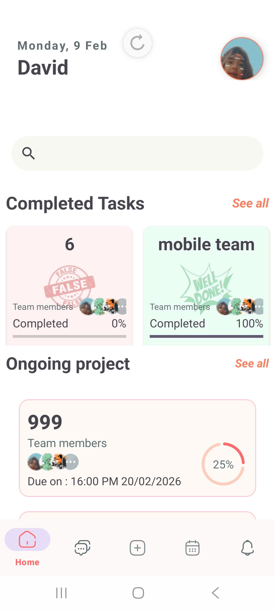
  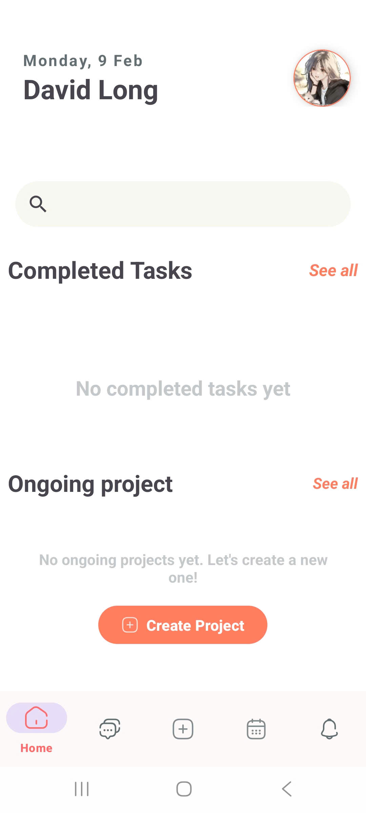

  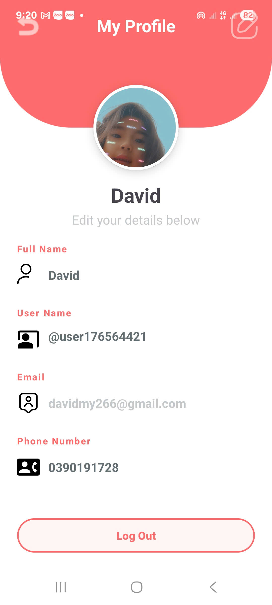
  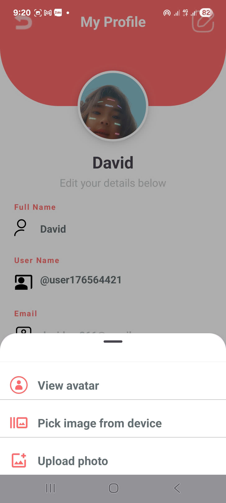

  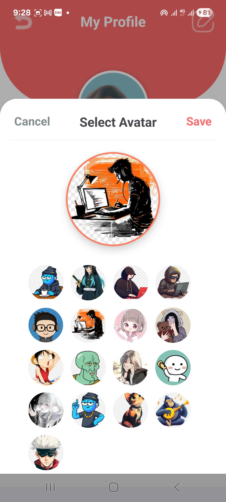
  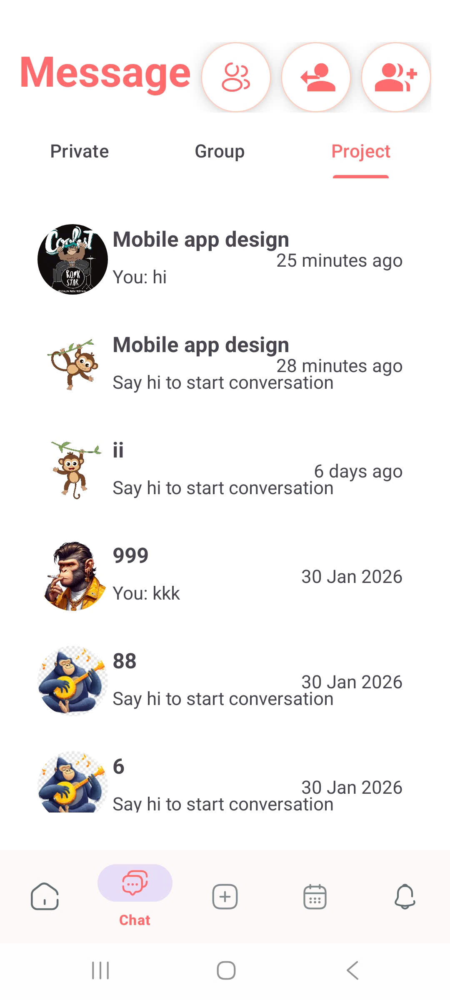

  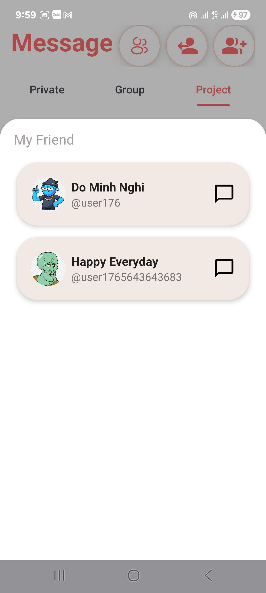
  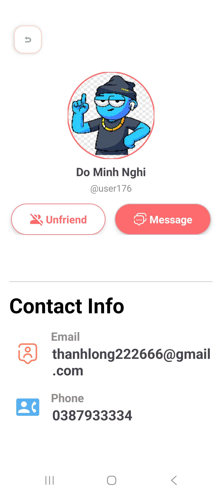

  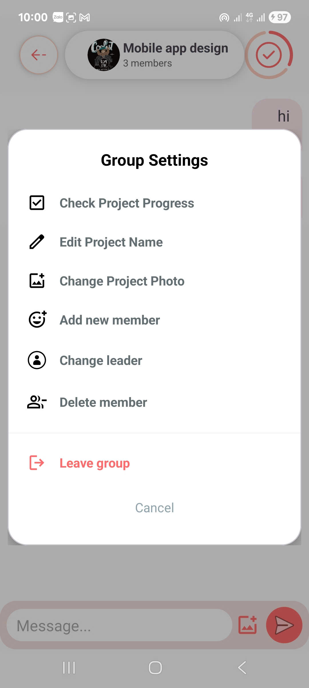
  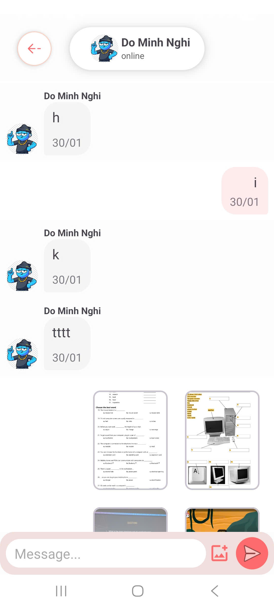

  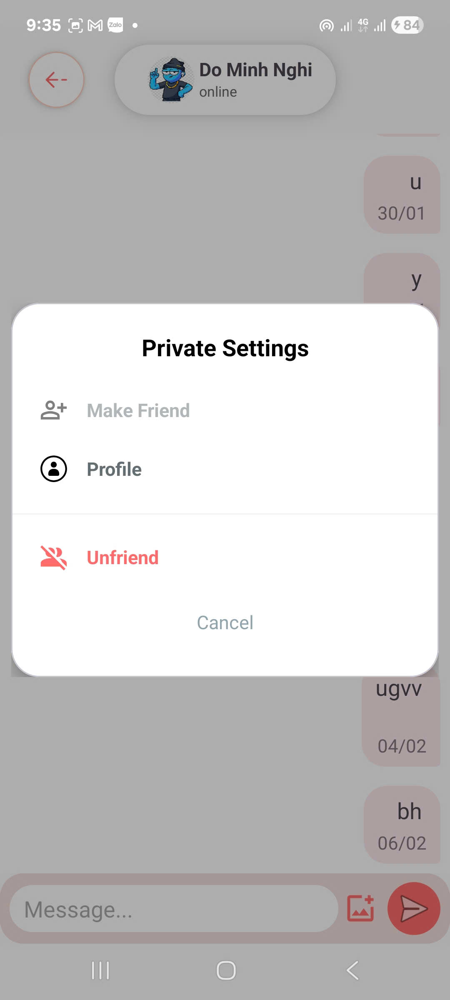
  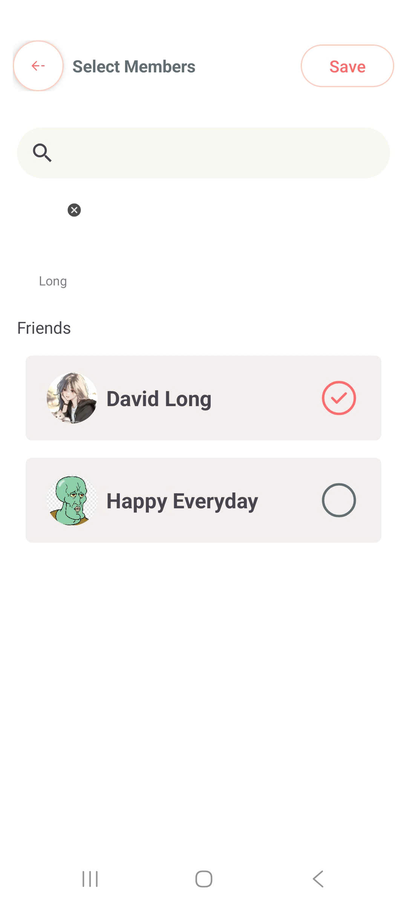

  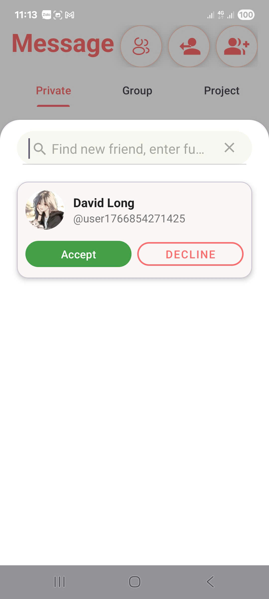
  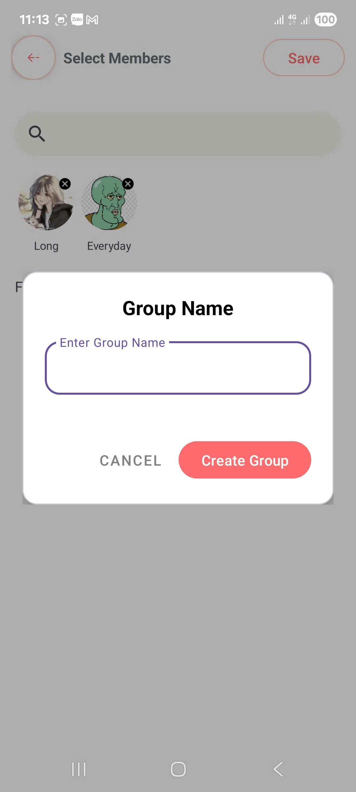

  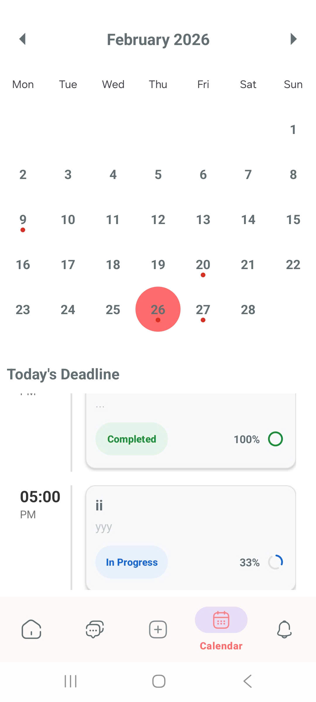
  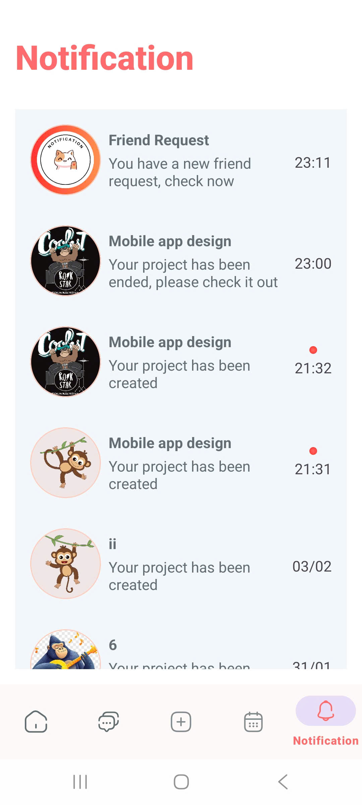

✨ **Tính năng Chính**

**1. Quản lý Dự án & Công việc**
- Tạo và quản lý dự án: Người dùng có thể tạo các nhóm dự án mới
- Theo dõi tiến độ: Hiển thị thanh tiến độ cho từng công việc (Completed, In Progress).
- Quản lý nhóm: Thêm, xóa thành viên vào dự án, thay đổi trưởng nhóm (Leader), đổi ảnh, đổi tên, xem tiến độ dự án

**2. Hệ thống Lịch & Deadline**
- Lịch cá nhân: Hiển thị thông tin các công việc cần hoàn thành trong ngày với trạng thái cụ thể

**3. Giao tiếp & Chat (Real-time)**
- Chat dự án (Project): Thảo luận nhóm trực tiếp trong từng dự án.
- Chat nhóm (Group): Nhóm trò chuyện riêng của User
- Chat cá nhân (Private): Nhắn tin riêng tư 1-1 với bạn bè.

**4. Mạng xã hội & Kết nối**
- Hệ thống bạn bè: Tìm kiếm người dùng, gửi lời mời kết bạn.

- Thông báo: Nhận thông báo về lời mời kết bạn,chấp nhận kết bạn, dự án mới được tạo, hoặc khi dự án kết thúc (Notification trực tiếp trong app, chưa có tính năng đẩy thông báo ra bên ngoài)

- Profile Other User: Hiển thị thông tin liên hệ (Email, Phone) và quản lý trạng thái bạn bè (Unfriend/Message).
---
🛠** Công nghệ Sử dụng**
- Ngôn ngữ: **Kotlin**

- Giao diện (UI): **XML**

- Kiến trúc: **MVVM**

- Backend: **Firebase**
